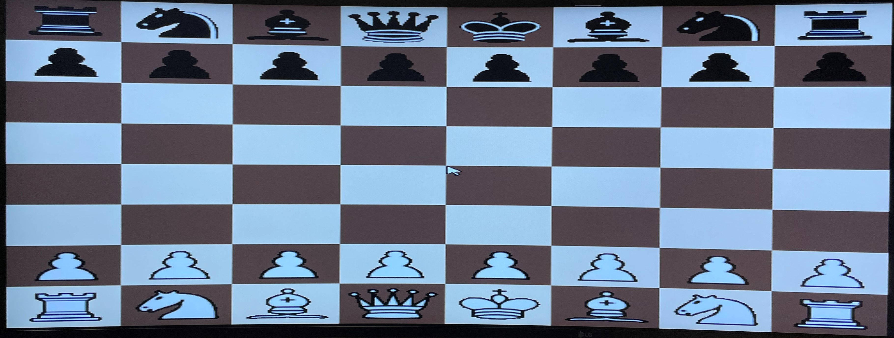

# PvP Chess on NIOS/II SOC

Our project is PvP chess running on NIOS/II SOC using MAX10 FPGA with VGA output.
 

## How to run our project
* Clone the git repository.
* Ensure the sprite data are loaded from the correct file path when using $readmemh.
* Attach the USB shield to the MAX10 FPGA board.
* Attach USB Mouse to the USB host port on the shield.
* Generate HDL in Platform Designer, compile in Quartus, program FPGA, generate BSP, build software and run configuration in Eclipse.
* Use the mouse to move chess pieces. The highlighted squares show the legal moves for the selected piece.
* If you want to restart the game at any point, click down on the scroll wheel.

## Primary Files
* In addition to the hardware SystemVerilog modules, the software is contained in main.c, game_ctrl.c, and game_ctrl.h.
